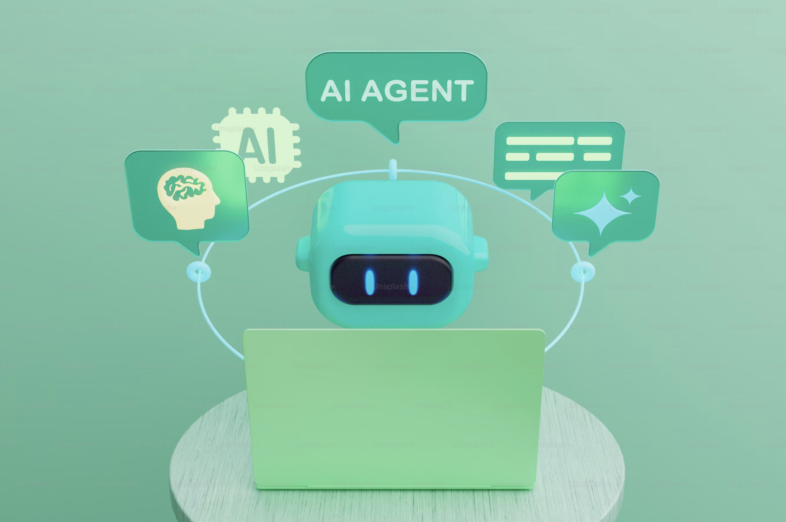

# AI Agent Portfolio Website



## 🚀 Overview

This project, built by Andrew Baisden, is a modern portfolio website enhanced with AI agents powered by Agno and Groq Cloud. It combines a Flask backend with a React frontend to deliver a personalized and interactive user experience. The AI agents handle customer inquiries, create content, analyze user behavior, and provide customized experiences for each visitor. I am posting it strictly to crib from because Andrew is amazing.

## ✨ Features

- **Multiple AI Agents**: Five specialized AI agents to assist users with different needs
- **Ultra-Low Latency**: Powered by Groq Cloud for high-speed token generation and fast responses
- **Personalized Experience**: Custom interactions based on user behavior and needs
- **Responsive Design**: Fully responsive web design that works on all devices
- **RESTful API**: Flask backend that serves as an API for the React frontend

## 🤖 AI Agents

The website features five specialized AI agents:

- **WelcomeAgent**: Helps users navigate the website based on whether they're an employer, client, or fellow programmer
- **ProjectAgent**: Provides detailed information about projects, technology stacks, and challenges
- **CareerAgent**: Shares information about skills, experience, and professional background
- **BusinessAdvisor**: Offers details about services, pricing, and project specifications
- **ResearchAgent**: Delivers information about technology trends and industry news

## 🏗️ Architecture

### Backend

- Python with Flask
- Agno for AI agent orchestration
- Groq Cloud for LLM inference
- Meta's LLaMA 3 model for AI reasoning

### Frontend

- React.js
- Modern UI components
- Interactive elements for agent communication

## 📋 Website Pages

1. **Home**: Main landing page with introduction
2. **Projects**: Showcases featured projects and technical skills
3. **Career**: Displays skills, experience, education, and certifications
4. **Services**: Outlines client services and the engagement process
5. **Research**: Provides industry research capabilities powered by AI
6. **Contact**: Contact form for inquiries

## 🛠️ Installation

### Prerequisites

- Python 3.8+
- Node.js 16+
- npm or yarn

### Backend Setup

1. Clone the repository

   ```bash
   git clone https://github.com/sgrisak/ai-agents.git
   cd ai-agents
   ```

2. Create and activate a virtual environment

   ```bash
   python3 -m venv venv
   source venv/bin/activate  # On Windows: venv\Scripts\activate
   ```

3. Install the required Python packages

   ```bash
   pip install agno groq flask flask_cors requests python-dotenv
   ```

4. Create a `.env` file in the root directory and add your Groq API key

   ```
   GROQ_API_KEY="your_groq_api_key"
   ```

5. Start the Flask server
   ```bash
   python main.py
   ```

### Frontend Setup

1. Navigate to the frontend directory

   ```bash
   cd frontend
   ```

2. Install dependencies

   ```bash
   npm install
   ```

3. Start the development server
   ```bash
   npm start
   ```

## 📁 Project Structure

```
ai-agent-portfolio/
├── .env                  # Environment variables
├── main.py               # Main Flask application
├── agents/
│   ├── __init__.py       # Agent package initialization
│   ├── base_agent.py     # Base agent class
│   ├── welcome_agent.py  # Welcome agent implementation
│   ├── project_agent.py  # Project agent implementation
│   ├── career_agent.py   # Career agent implementation
│   ├── client_agent.py   # Business advisor implementation
│   └── research_agent.py # Research agent implementation
└── frontend/             # React frontend application
```

## 💡 How It Works

1. The user interacts with the React frontend
2. Requests are sent to the Flask backend API
3. The appropriate AI agent is activated based on the request
4. Agno orchestrates the agent's reasoning and response generation
5. Groq Cloud provides high-speed LLM inference
6. The response is returned to the frontend and displayed to the user

## 🔗 Technologies Used

- [Agno](https://github.com/agno-ai/agno) - Lightweight library for building multimodal agents
- [Groq Cloud](https://console.groq.com) - Ultra-fast AI inference platform
- [Flask](https://flask.palletsprojects.com/) - Python web framework
- [React](https://reactjs.org/) - JavaScript library for building user interfaces
- [LLaMA 3](https://ai.meta.com/llama/) - Large language model from Meta

## 🔒 Security

- API keys are stored securely in environment variables
- User data is processed with privacy in mind
- No sensitive information is stored permanently

## 📈 Performance

The combination of Agno and Groq Cloud provides exceptionally low latency responses:

- Average response time: < 500ms
- Token generation rate: Up to 800 tokens/second

## 📝 License

This project is licensed under the MIT License - see the [LICENSE](LICENSE) file for details.

Built by the machinery maestro, Andrew Baisden!
